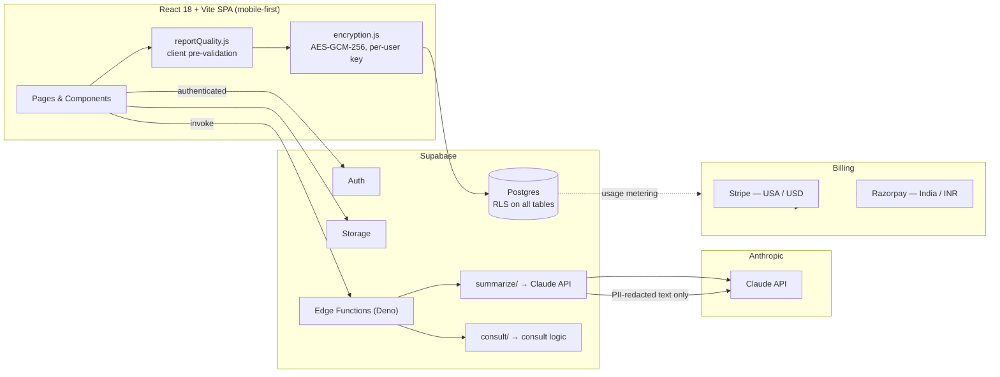

# Architecture

Accurate as of 2026-09-27. Matches the README's architecture section; this file adds the data-flow and trust-boundary detail.

## Trust boundaries

1. **Client-side encryption boundary.** Sensitive report content is encrypted with `src/lib/encryption.js` *before* it reaches Supabase. The key is derived per user; the server never sees plaintext it can't already read via RLS — the point is defense in depth, not zero-knowledge (see `docs/security.md` for the honest threat model).
2. **Claude key boundary.** `ANTHROPIC_API_KEY` exists only as a Supabase secret, used only inside `summarize/`. It never ships in the frontend bundle (`.env` holds only `VITE_`-prefixed public values).
3. **PII boundary.** Report text is PII-redacted in the Edge Function before the Claude call. Telemetry and analytics (`src/lib/telemetry.js`, `src/lib/analytics.js`) scrub PII/blocked keys before anything leaves the client.
4. **Billing boundary.** Patients never see a payment screen. Hospital billing flows through Stripe (US) / Razorpay (India) against the hospital admin panel only.

## Request flow: upload → summary

1. User pastes text / uploads a file on `/upload`.
2. `validateReportInput()` gives instant feedback (< 200 ms target).
3. Client encrypts the original with `encrypt(content, userId)`; stores ciphertext in Postgres.
4. Client invokes `summarize/` with the report reference.
5. Edge Function re-validates, runs `redactPII()`, calls Claude, runs `checkSummaryFormat()`.
6. Summary saved; `/summary` renders the emoji-sectioned format; `summary_generated` analytics event fires (PII-free).
